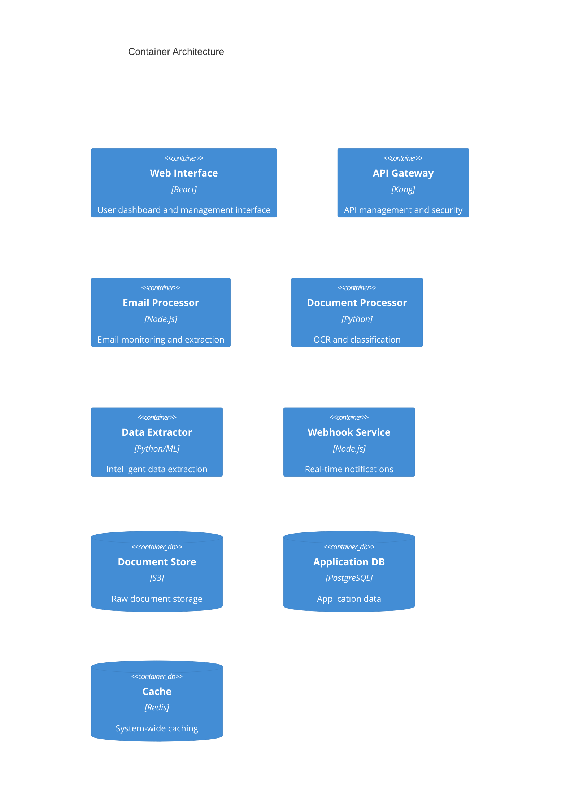

# AI-Driven Application Intake Platform

[](https://github.com/dollarfunding/ai-intake-platform/actions)
[](https://github.com/dollarfunding/ai-intake-platform/security)
[](LICENSE)

Enterprise-grade AI-driven platform for automated processing of Merchant Cash Advance (MCA) applications with advanced OCR, data extraction, and secure document handling capabilities.

## Project Overview

The AI-Driven Application Intake Platform is a transformative automation solution that streamlines the MCA application processing workflow through:

- Automated email monitoring and document extraction
- Advanced OCR and ML-based data classification
- Secure document storage and processing
- RESTful API and webhook integration
- Real-time monitoring and alerting

### Architecture



## Prerequisites

### System Requirements
- Node.js v18 LTS
- Python 3.11
- Docker v24
- Azure CLI
- Kubernetes CLI
- Terraform >= 1.0

### Hardware Requirements
- CPU: 4 cores minimum
- Memory: 16GB minimum
- Storage: 100GB SSD minimum

### Access Requirements
- Azure subscription with admin access
- Docker registry access
- Kubernetes cluster admin access
- Database administration rights

## Installation

1. Clone the repository:
```bash
git clone https://github.com/dollarfunding/ai-intake-platform.git
cd ai-intake-platform
```

2. Install dependencies:
```bash
# Backend dependencies
cd src/backend
npm install

# Frontend dependencies
cd ../web
npm install
```

3. Configure environment:
```bash
# Copy environment templates
cp .env.example .env
cp src/backend/.env.example src/backend/.env
cp src/web/.env.example src/web/.env

# Update environment variables with your configuration
```

4. Setup infrastructure:
```bash
# Initialize Terraform
cd infrastructure
terraform init

# Deploy infrastructure
terraform apply
```

5. Deploy application:
```bash
# Deploy to Kubernetes
kubectl apply -f infrastructure/kubernetes/
```

## Development

### Development Workflow
1. Create feature branch from main
2. Implement changes following security standards
3. Run tests and security scans
4. Submit PR with required reviews
5. Merge after approval

### Available Scripts

```bash
# Backend development
cd src/backend
npm run start:dev     # Start development server
npm run test         # Run tests
npm run test:cov     # Run tests with coverage
npm run lint         # Run linting

# Frontend development
cd src/web
npm run dev          # Start development server
npm run build        # Build production bundle
npm run test         # Run tests
npm run lint         # Run linting
```

## Deployment

### Azure Infrastructure
1. Configure Azure credentials
2. Initialize Terraform backend
3. Apply Terraform configuration
4. Verify resource creation

### Kubernetes Deployment
1. Configure kubectl context
2. Apply namespace configuration
3. Deploy core services
4. Configure ingress and TLS
5. Verify deployment status

### Deployment Verification
```bash
# Check pod status
kubectl get pods -n application-ns

# Verify services
kubectl get services -n application-ns

# Check logs
kubectl logs -n application-ns deployment/api-gateway
```

## Security

### Security Architecture
- AES-256-GCM encryption at rest
- TLS 1.3 encryption in transit
- Role-based access control (RBAC)
- Network security policies
- Pod security policies
- Audit logging

### Compliance
- SOC 2 Type II controls
- PCI DSS requirements
- GDPR compliance
- Data protection measures

## Monitoring

### Metrics and KPIs
- Application performance metrics
- OCR accuracy rates
- Processing throughput
- Error rates
- Resource utilization

### Logging
- Centralized logging with ELK Stack
- Application logs
- Security audit logs
- Performance metrics

## Operations

### Backup Procedures
- Database backups every 6 hours
- Document storage daily snapshots
- Configuration backups
- Disaster recovery testing

### Scaling Guidelines
- Horizontal pod autoscaling
- Resource quotas
- Load balancing
- Performance optimization

## Support

For support and inquiries:
- Technical Support: support@dollarfunding.com
- Security Issues: security@dollarfunding.com
- Emergency Contact: Available upon request

## License

This project is licensed under a custom license - see the [LICENSE](LICENSE) file for details.

---

© 2023 Dollar Funding. All rights reserved.